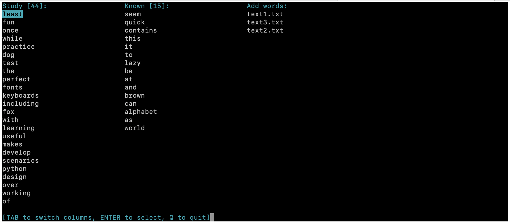

## WordsStudy

**This Python application helps you learn new words and build your vocabulary effectively.**

#### Features:
- **Learn from Text Files**: Import words directly from plain text files stored in a dedicated "learn" directory.
- **Create Your List**: Add new words manually and build a customized vocabulary list.
- **Review & Practice**: Review your saved vocabulary and test your knowledge with built-in counters to track progress.

#### Requirements:
*  Python 3.x
*  Modules:
    * `re`: Regular expressions for advanced text processing (optional)
    * `curses`: Text-based user interface (optional, for a more interactive experience)
    * `os`: Operating system interaction for file management

#### Installation:
Ensure you have Python 3.x installed.
Download or clone the WordsStudy source code. Install additional modules using pip install re curses os if you want to enable advanced features.

#### Usage:
Place your text files containing words you want to learn in the learn directory.

Run the program with the command: `python3 run.py`
